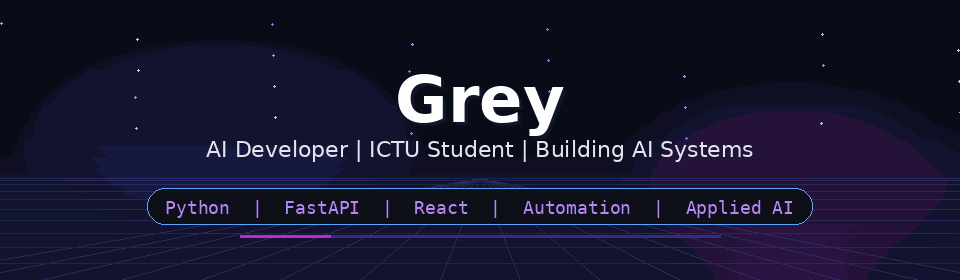

  

  

---

# Connect with me 😎

# Achievements 🏆

&nbsp;

&nbsp;

&nbsp;

---

# About Me 🧠

---

- 💻 AI Developer from Thai Nguyen, Viet Nam.
- 🎓 Student at ICTU.
- 🚀 Building AI tools, automation systems, and intelligent workflows.
- ⚡ Focused on frontend architecture and backend optimization.
- 🧠 Exploring machine learning and applied AI systems.
- 🎨 Interested in modern UI/UX and interactive experiences.
- 🤝 Open for collaboration on AI and software projects.
- 📫 Contact: **qvinhcoitn9@gmail.com**

 
 

---

# Stats 📊

 

---

  

